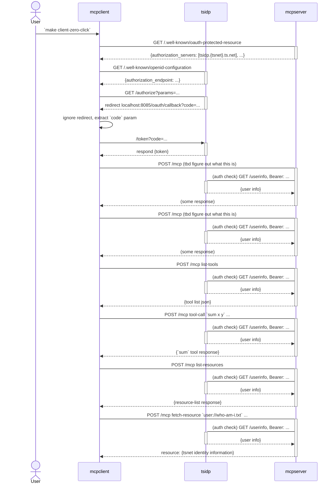

# What is this?

This repo is an exploration of what the developer experience could be like building MCP servers on a tailnet. tsidp provides OAuth2 access tokens and user information about the tailescale authenticated user.

Demonstrated is a zero-click authentication flow where the client goes through these steps:

1. client makes request to server
2. server returns 401 Unauthorized with a `WWW-Authenticate` that redirects the clien to tsidp
3. client does a "zero-click" flow, as accessing tsidp on the tailnet does not require a client id or secret.
4. After successful authentication, the client makes an MCP tool and resource call.

## Running zero-click client flow:

1. copy the `.env.example` to `.env` and customize for your environment
2. `make` - to pull in dependencies
3. `make tsidp` - starts tsidp server. follow auth instructions.
4. `make server` - starts the MCP server. Use a separate terminal window.
5. `make client-zero-click` - runs client clow. Use a separate terminal window.
6. observe the output

## Goal

- demonstration of an MCP server/client oauth flow with tsidp
- very minimal implementation to make it as accessible for learning as possible
- simple setup

## Todo:

- ✅ mcp server
  - ✅ supports Oauth2 access token authentication
  - ✅ supports [RFC9728 (April 2025)](https://www.rfc-editor.org/rfc/rfc9728.html) - OAuth 2.0 Protected Resource Metadata
    - 🙃 beyond SOTA LLM knowledge cutoff date
  - ✅ merge the oauth/ and mcp/ packages into the server
  - ✅ accept `-listen` on cli, default to `localhost:8080`
  - ✅ change mcp resource to return user info
- ▢ client that
  - ✅ performs a MCP tool call
  - ✅ performs a MCP resource fetch
  - ✅ use mcp resource call to get user info
  - ▢ accept `-mcpURL` flag, default to `http://localhost:8080/mcp`
  - ▢ accept `-callbackURL` flag, default to `http://localhost:8085/oauth/callback`,
  - ▢ supports DCR (dynamic client registration)
  - ✅ change default flow to "zero click"
  - ✅ add a `-browserLogin` flag to use the browser login flow
- ▢ tsidp
  - ✅ vendor in tsidp
  - ▢ add support for DCR
- ✅ reorganize repo into `/client`, `/server`, `/tsidp` subdirectories (all `main` package)
- ✅ add a Makefile to make it easy to run (`make client`, `make server`, `make tsidp`)
- ▢ ...

---

## Notes about funnel-tsidp

- tsidp's `/authorize` endpoint must be called on tailnet.
  - It will response with a 401 Unauthorized otherwise.
  - all other endpoints `/token`, `/userinfo`, `/clients` can be called over Funnel
- the mcp resource server (`mcpserver`) can be run anywhere
- the mcp client (`mcpclient`) has to be run in the (any?) tailnet as it will
- the `make tsidp-funnel`, the `/token` endpoint can be called by

### The Setup

1. **Funnel clients** are OIDC clients (like external web apps) that live **outside the tailnet** on the public internet
2. These clients are registered with the IDP and stored with a client ID, secret, and redirect URI
3. The IDP itself can be exposed via Tailscale Funnel to be accessible from the internet

### The Authorization Flow

When an external app wants to authenticate a Tailscale user:

1. **External app redirects user to the IDP's authorize endpoint**

   - The external app (on the public internet) redirects the user's browser to: `https://mcp-demo-idp-funnel.<tsname>.ts.net/authorize/funnel?client_id=xxx&redirect_uri=https://externalapp.com/callback`

2. **User's browser makes the request**

   - Even though the IDP is accessible via funnel, the user making this request is **inside the tailnet** (they're a Tailscale user trying to log in)
   - So this isn't a funnel request from the IDP's perspective - it's a regular tailnet request **!IMPORTANT!**
   - The path `/authorize/funnel` tells the IDP "this is for a funnel client"

3. **IDP validates and redirects back**

   - The IDP checks that the client_id matches a registered funnel client
   - Creates an auth code and redirects the user back to the external app with the code

4. **External app exchanges code for token**
   - Now the external app (via funnel) calls `/token` with the code and its client credentials
   - This IS a funnel request, and the `/token` endpoint allows it by validating the client credentials

### The Key Insight

The `/authorize/funnel` endpoint is accessed by **Tailscale users** (not via funnel) who are authorizing **external apps** (that will later access via funnel with calls to `/token`). It's the user-facing part of the OAuth flow, while the `/token` endpoint is the machine-to-machine part that actually uses funnel.
