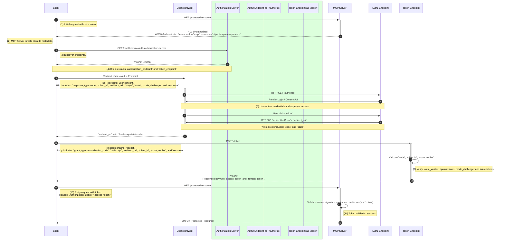

# **The Model Context Protocol Authorization Framework: An OAuth 2.1 Sequence Diagram and Technical Analysis**

## **1\. Executive Summary: The Model Context Protocol Authorization Framework**

The Model Context Protocol (MCP) defines a robust and secure authorization framework by adopting a specialized implementation of the OAuth 2.1 Authorization Code flow with Proof Key for Code Exchange (PKCE). This architecture is predicated on a foundational design principle: the MCP server operates as a stateless OAuth Resource Server, completely decoupled from the responsibilities of an Authorization Server. This strategic separation of concerns streamlines development and deployment, particularly in enterprise environments where established identity providers are already in place. The flow delineates clear roles for three primary actors: the **MCP Client** (e.g., an AI agent), a separate, trusted **Authorization Server**, and the **MCP Server** itself. The **Resource Owner**, or user, interacts directly with the Authorization Server to grant consent. The framework's security is significantly enhanced by mandatory protocol-level requirements, including the use of PKCE for public clients and the explicit binding of access tokens to the MCP server's canonical URI via the resource parameter, as specified in RFC 8707\. These measures collectively ensure that the protocol is not only scalable and flexible but also inherently resistant to common security vulnerabilities.

## **2\. Foundations of OAuth and MCP Integration**

### **2.1. The Evolved OAuth Ecosystem: Delineating the Four Core Roles**

The OAuth 2.0 authorization framework, and its successor OAuth 2.1, establish a clear protocol for delegated authorization, allowing a third-party application to access protected resources on behalf of a user without handling the user's long-term credentials.1 This architecture relies on four distinct roles, which are critical to understanding the MCP's security model.

- **Client:** Often referred to as "the app," the Client is the application that requests access to a protected resource.1 In the MCP context, this role is filled by the MCP Client, which could be an AI agent running on a mobile device or a traditional web application.3 The client is the entity that ultimately makes the request to the MCP server for protected assets on behalf of the resource owner.1
- **Resource Owner:** This is the entity, typically the end-user, who owns the protected data and is capable of granting access to it.1 The resource owner's consent is the cornerstone of the OAuth flow, as they must explicitly approve the client's request to access their data.1
- **Authorization Server:** This server is responsible for authenticating the resource owner and issuing credentials, specifically access tokens, to the client after receiving proper authorization.1 The Authorization Server is essentially the "token minting engine" of the ecosystem, managing user authentication and providing the necessary tokens for a client to proceed.5
- **Resource Server:** This is the server hosting the protected resources that the client wants to access.2 It requires some form of authorization, such as a valid access token, before serving up protected resources.1 The MCP server, as defined by the protocol specification, is explicitly designed to act in this role.3

### **2.2. The Model Context Protocol as a Stateless Resource Server: A Foundational Architectural Choice**

A fundamental and deliberate architectural decision within the MCP specification is to mandate that the MCP server operates solely as an OAuth resource server.3 This choice is not merely an implementation detail; it is a strategic design principle that has profound implications for scalability, security, and developer experience.

A naive approach to authorization might involve embedding the identity provider's functionality—including user authentication, token issuance, and session management—directly within the MCP server. However, the MCP protocol explicitly avoids this high-complexity, high-risk model. Implementing and maintaining a full Authorization Server, complete with discovery, registration, authorization, and token endpoints, is a non-trivial undertaking that can be a major source of vulnerabilities.7 By offloading these concerns to a dedicated, battle-tested Authorization Server, the MCP server can remain stateless and focused on its core function: serving protected resources.7

This architectural pattern offers a number of critical advantages. First, it significantly reduces the complexity for developers creating MCP servers. They do not need to concern themselves with complex session management or the secure storage of client credentials.7 Second, it allows the MCP server to be fully stateless, which is a prerequisite for horizontal scalability. A stateless server can be deployed across a cluster of instances (e.g., in a containerized environment) and handle requests without relying on shared, stateful session data.7 This design maximizes performance and availability. Finally, this design choice substantially increases the protocol's adoptability within enterprise settings. Large organizations already have established identity providers (e.g., Okta, Auth0, or an internal solution) that are compliant with OpenID Connect (OIDC) or SAML.7 By positioning the MCP server as a simple resource server, the protocol allows for seamless integration into these existing ecosystems, enabling MCP clients to leverage any supported OAuth flow to retrieve a token.7 This approach streamlines enterprise adoption by enhancing existing integrations rather than requiring a complete overhaul of the authentication infrastructure.7

## **3\. The Authorization Code Flow with PKCE: A Technical Walkthrough**

The MCP authorization flow, as defined, is a variation of the OAuth 2.1 Authorization Code flow, enhanced with the Proof Key for Code Exchange (PKCE) protocol. This walkthrough details the end-to-end process from the initial unauthorized request to the final successful access of a protected resource.

### **3.1. Phase 1: Initiation and Authorization Grant**

#### **Step 1: The Unauthorized Request and WWW-Authenticate Header**

The flow begins when an MCP Client attempts to access a protected resource on an MCP server without providing a valid access token in the request headers.4 The MCP server, acting in its capacity as a resource server, recognizes the request as unauthorized. Rather than simply returning an error, the protocol mandates a specific, deliberate response: an

HTTP 401 Unauthorized status code.3

Crucially, this response is not a dead end. It is a fundamental bootstrapping mechanism of the protocol. The MCP server is required to include a WWW-Authenticate HTTP header in the response, which directs the client to the location of the resource server's metadata URL.3 This header provides a machine-readable signal that tells the client where to begin the authorization process. This process elegantly decouples the client from any hardcoded knowledge of the authorization server's location, making the system more flexible and dynamic.

#### **Step 2: Authorization Server Discovery**

After receiving the 401 Unauthorized response, the MCP Client parses the WWW-Authenticate header to find the resource server's metadata URL. The client then makes a request to this URL, which typically points to a well-known endpoint such as /.well-known/oauth-authorization-server.4 This request returns a JSON document containing a host of critical information, including the

authorization_endpoint, token_endpoint, and other supported methods like scopes and PKCE methods.4 This discovery step is a key component of the MCP specification, as it allows the client to dynamically find all the necessary endpoints to proceed with the flow.6

#### **Step 3: Crafting the Authorization Request with PKCE and Resource Indicators**

With the Authorization Server's endpoints discovered, the MCP Client is ready to initiate the user-facing part of the flow. Since MCP clients are considered public clients (unable to securely store a client_secret), they must use the PKCE protocol.3 The client first generates a cryptographically random

code_verifier string.8 It then hashes this verifier using the SHA256 algorithm to create a

code_challenge.8

The client then redirects the user's browser to the Authorization Server's authorization_endpoint, appending several key parameters to the URL query string.4 These include:

- response_type=code: Specifies the Authorization Code grant type.2
- client_id: The identifier for the MCP Client.2
- redirect_uri: The URL to which the user's browser should be redirected after authorization.2
- scope: A space-delimited list of permissions the client is requesting (e.g., todos.read todos.write).2
- state: An opaque, random value used to mitigate Cross-Site Request Forgery (CSRF) attacks.2
- code_challenge and code_challenge_method=S256: The PKCE parameters.4

A mandatory requirement of the MCP specification, per RFC 8707, is the inclusion of the resource parameter.3 This parameter must contain the canonical URI of the MCP server that the client intends to access.3 This inclusion is a vital security layer that binds the resulting access token to its intended audience. Without it, a token issued for one service could be misused at another, a critical vulnerability that the MCP protocol proactively mitigates.

#### **Step 4: User Authentication and Consent**

The user's browser is now at the Authorization Server's authorization_endpoint. The user is prompted to sign in if they are not already authenticated.4 The Authorization Server then presents a consent screen that clearly lists the permissions (scopes) that the MCP Client is requesting.4 This step is crucial, as it places the resource owner in explicit control over their data, reinforcing trust in the system.1

### **3.2. Phase 2: Secure Token Exchange and Resource Access**

#### **Step 5: Redirect with the Authorization Code**

Upon the user's approval, the Authorization Server does not immediately provide a token. Instead, it redirects the user's browser back to the MCP Client's registered redirect_uri.4 This redirection includes two key query parameters: a one-time-use

code (the authorization code) and the original state parameter.4

#### **Step 6: Exchanging the Code for Tokens**

The MCP Client's server-side component receives the redirect. The client then initiates a secure, server-to-server POST request to the Authorization Server's token_endpoint.4 This is a back-channel communication that is not exposed to the user's browser. The request body includes:

- grant_type=authorization_code.9
- The code received in the previous step.9
- The redirect_uri.9
- The client_id.9
- The original, unhashed code_verifier.4

The Authorization Server validates this request by verifying the code, client_id, and redirect_uri. Most importantly, it verifies that the provided code_verifier matches the code_challenge that was sent in the initial authorization request.4 If this validation passes, the server responds with a JSON object containing the

access_token and an optional refresh_token.9

#### **Step 7: The Access Token and Resource Access**

The MCP Client has successfully obtained the access_token. It can now make a new request to the protected endpoint on the MCP server, this time including the access token in the Authorization: Bearer \<access-token\> header.4 The MCP server, acting as a resource server, validates this token. The validation process involves checking the token's signature (to ensure its authenticity), its expiration time, and its scopes.

Most critically, the MCP server **must** validate that the token was issued specifically for its own canonical URI, as defined by the resource parameter in the initial request.3 This audience validation (

aud claim) is a core security requirement of the MCP specification. If the token's audience does not match the MCP server's URI, the server must reject the request with an HTTP 401 response.3 This check prevents a "confused deputy" problem where a token for one service is mistakenly or maliciously used at another, more sensitive service. If all validation checks pass, the MCP server processes the request and returns the protected resource to the client.4

## **4\. The Mermaid Sequence Diagram: A Visual Specification**

### **4.1. Diagramming Conventions and Syntax**

The following diagram uses Mermaid syntax to visually represent the entire OAuth-MCP authorization flow. The participants are defined implicitly in the order of their first appearance. A box is used to group the Authorization Server's components, which include its authorization_endpoint and token_endpoint, to illustrate the logical separation from the MCP server. Arrows represent messages, with a solid line (-\>\>) indicating a synchronous request and a dotted line (--\>\>) representing a synchronous response. Activation and deactivation markers (+ and \-) denote when a participant is actively processing a request. Notes (Note over) are used to provide additional context for specific steps in the flow.11

### **4.2. Complete Diagram Code**

## **5\. Advanced Topics and Implementation Details**

### **5.1. Token Validation and Audience Binding: A Critical Security Layer**

When an MCP server receives a request with a bearer token, it must perform a series of validations to ensure the request is legitimate.3 Beyond standard checks like verifying the token's signature and expiration time, the MCP specification mandates a critical security measure: audience binding.3 The MCP server must validate that the access token was explicitly issued for its own audience, typically by checking the

aud claim within the token.3 This verification directly links back to the

resource parameter sent in the initial authorization request. The authorization server, when minting the token, includes this audience information, and the MCP server must subsequently verify it.

The significance of this check cannot be overstated. A malicious client could attempt to use an access token obtained for a different, potentially less-sensitive service and try to gain access to a protected resource on the MCP server. By strictly enforcing audience validation, the MCP server rejects any tokens not explicitly intended for its use, effectively preventing this "confused deputy" vulnerability.6 This requirement, while adding implementation complexity, is a non-negotiable part of building a secure and compliant MCP server.7

### **5.2. Handling Token Expiration and Renewal**

Access tokens are intentionally designed to be short-lived to minimize the window of opportunity for attackers should a token be compromised.12 Once an access token expires, the MCP client can no longer use it to access protected resources and will receive a

401 Unauthorized response.3 To provide a seamless user experience, the protocol allows for token renewal without requiring the user to re-authenticate.

This is the purpose of the refresh_token.12 A client can exchange a long-lived refresh token at the Authorization Server's token endpoint to obtain a new, short-lived access token.13 A best practice, known as refresh token rotation, is also recommended.13 With this mechanism, each use of a refresh token yields not only a new access token but also a new refresh token, while invalidating the old one. This ensures that a compromised refresh token can only be used once, significantly limiting its value to an attacker.12

### **5.3. Error Handling and Security Practices**

During the authorization flow, various errors can occur, from user denials to malformed requests.14 The protocol defines a standardized way for the Authorization Server to communicate these failures. When an error occurs during the authorization request, the server redirects back to the client's

redirect_uri with error and error_description query parameters.14 For token requests, the errors are returned in a JSON body.14

The following table outlines some of the most common OAuth errors and their implications.

| Error Code                 | Description                                                        | Cause                                                                                                                                                      | Client Handling                                                                                                             |
| :------------------------- | :----------------------------------------------------------------- | :--------------------------------------------------------------------------------------------------------------------------------------------------------- | :-------------------------------------------------------------------------------------------------------------------------- |
| invalid_grant              | The authorization code, refresh token, or password is invalid.     | The authorization code is expired, already used, or invalid. PKCE code_verifier does not match the code_challenge. The user may not have approved the app. | The client should typically end the flow and prompt the user to restart the process. 14                                     |
| invalid_client_credentials | The client secret is incorrect or invalid.                         | An incorrect client_id or client_secret was provided to the token endpoint.                                                                                | The client should check its configuration and correct the credentials. 14                                                   |
| invalid_scope              | The requested scope is invalid, unknown, or malformed.             | The scope parameter in the authorization request contains an invalid value.                                                                                | The client should revise the requested scopes to match those supported by the Authorization Server. 14                      |
| redirect_uri_mismatch      | The provided redirect_uri does not match the pre-registered value. | The redirect_uri in the authorization request is incorrect or was not registered with the Authorization Server.                                            | The client must ensure the redirect_uri is a precise match to the one registered with the Authorization Server. 14          |
| access_denied              | The resource owner denied the request.                             | The user clicked "Deny" on the consent screen.                                                                                                             | The client should handle this gracefully, perhaps by displaying a message to the user explaining that access was denied. 15 |

## **6\. Conclusion**

The Model Context Protocol's authorization framework represents a sophisticated and forward-looking approach to delegated access in a distributed system. By leveraging the battle-tested OAuth 2.1 Authorization Code flow and positioning the MCP server as a stateless, scalable resource server, the protocol elegantly solves the complex problem of securing access to protected resources without burdening server developers with the overhead of identity management. The mandatory security measures, particularly the use of PKCE and the explicit audience binding via the resource parameter, are not merely best practices but core components that make this framework exceptionally secure and resilient. The combination of clear role separation, robust protocol requirements, and a focus on stateless, scalable architecture ensures that the MCP ecosystem can grow while maintaining a strong security posture, facilitating its adoption across a wide range of enterprise and public-facing applications.

#### **Appendix A: Reference Tables**

#### **Table 2: Key Request and Response Parameters**

| Parameter             | Flow Stage                             | Description                                                                          | Source |
| :-------------------- | :------------------------------------- | :----------------------------------------------------------------------------------- | :----- |
| response_type         | Authorization Request                  | Tells the Authorization Server which grant to execute. Must be code.                 | 2      |
| client_id             | Authorization & Token Requests         | The public identifier of the MCP Client.                                             | 2      |
| redirect_uri          | Authorization & Token Requests         | The URL to which the user's browser is redirected after authorization.               | 2      |
| scope                 | Authorization Request                  | A space-delimited list of permissions requested by the client.                       | 2      |
| state                 | Authorization Request                  | An opaque value used to maintain state and mitigate CSRF attacks.                    | 2      |
| code_challenge        | Authorization Request                  | A transformed value of the code_verifier, used for PKCE.                             | 4      |
| code_challenge_method | Authorization Request                  | Specifies the method used to transform the code_verifier. Must be S256.              | 4      |
| resource              | Authorization & Token Requests         | The canonical URI of the MCP server. **Mandatory** for MCP.                          | 3      |
| code                  | Authorization Response & Token Request | A one-time-use authorization code.                                                   | 4      |
| grant_type            | Token Request                          | The type of grant requested. Must be authorization_code.                             | 9      |
| code_verifier         | Token Request                          | The original, unhashed random string used to verify the code_challenge.              | 4      |
| access_token          | Token Response                         | A short-lived credential used to access protected resources.                         | 9      |
| refresh_token         | Token Response                         | A long-lived token used to obtain a new access token without user re-authentication. | 9      |
| expires_in            | Token Response                         | The lifespan of the access token in seconds.                                         | 9      |
| token_type            | Token Response                         | The type of token issued, e.g., "Bearer".                                            | 9      |

#### **Works cited**

1. Introduction to OAuth 2.0 | Apigee \- Google Cloud, accessed August 28, 2025, [https://cloud.google.com/apigee/docs/api-platform/security/oauth/oauth-introduction](https://cloud.google.com/apigee/docs/api-platform/security/oauth/oauth-introduction)
2. OAuth 2.0 Authorization Framework \- Auth0, accessed August 28, 2025, [https://auth0.com/docs/authenticate/protocols/oauth](https://auth0.com/docs/authenticate/protocols/oauth)
3. Authorization \- Model Context Protocol, accessed August 28, 2025, [https://modelcontextprotocol.io/specification/2025-06-18/basic/authorization](https://modelcontextprotocol.io/specification/2025-06-18/basic/authorization)
4. OAuth for MCP explained with a real-world example \- Stytch, accessed August 28, 2025, [https://stytch.com/blog/oauth-for-mcp-explained-with-a-real-world-example](https://stytch.com/blog/oauth-for-mcp-explained-with-a-real-world-example)
5. OAuth 2.0 and OpenID Connect overview | Okta Developer, accessed August 28, 2025, [https://developer.okta.com/docs/concepts/oauth-openid/](https://developer.okta.com/docs/concepts/oauth-openid/)
6. Authorization \- Model Context Protocol, accessed August 28, 2025, [https://modelcontextprotocol.io/specification/draft/basic/authorization](https://modelcontextprotocol.io/specification/draft/basic/authorization)
7. Treat the MCP server as an OAuth resource server rather than an authorization server · Issue \#205 \- GitHub, accessed August 28, 2025, [https://github.com/modelcontextprotocol/modelcontextprotocol/issues/205](https://github.com/modelcontextprotocol/modelcontextprotocol/issues/205)
8. OAuth 2.0 for Mobile & Desktop Apps \- Google for Developers, accessed August 28, 2025, [https://developers.google.com/identity/protocols/oauth2/native-app](https://developers.google.com/identity/protocols/oauth2/native-app)
9. Example Flow \- OAuth 2.0 Simplified \- OAuth.com, accessed August 28, 2025, [https://www.oauth.com/oauth2-servers/server-side-apps/example-flow/](https://www.oauth.com/oauth2-servers/server-side-apps/example-flow/)
10. Authorization Code Flow \- Auth0, accessed August 28, 2025, [https://auth0.com/docs/get-started/authentication-and-authorization-flow/authorization-code-flow](https://auth0.com/docs/get-started/authentication-and-authorization-flow/authorization-code-flow)
11. Sequence Diagram \- Mermaid Chart \- Create complex, visual ..., accessed August 28, 2025, [https://docs.mermaidchart.com/mermaid-oss/syntax/sequenceDiagram.html](https://docs.mermaidchart.com/mermaid-oss/syntax/sequenceDiagram.html)
12. What Are Refresh Tokens and How to Use Them Securely \- Auth0, accessed August 28, 2025, [https://auth0.com/blog/refresh-tokens-what-are-they-and-when-to-use-them/](https://auth0.com/blog/refresh-tokens-what-are-they-and-when-to-use-them/)
13. OAuth 2.0 Refresh Token Flow for Renewed Sessions \- Salesforce Help, accessed August 28, 2025, [https://help.salesforce.com/s/articleView?id=sf.remoteaccess_oauth_refresh_token_flow.htm\&language=en_US\&type=5](https://help.salesforce.com/s/articleView?id=sf.remoteaccess_oauth_refresh_token_flow.htm&language=en_US&type=5)
14. OAuth 2.0 Authorization Errors \- Salesforce Help, accessed August 28, 2025, [https://help.salesforce.com/s/articleView?id=sf.remoteaccess_oauth_flow_errors.htm\&language=en_US\&type=5](https://help.salesforce.com/s/articleView?id=sf.remoteaccess_oauth_flow_errors.htm&language=en_US&type=5)
15. Authorization Errors | Device Access \- Google for Developers, accessed August 28, 2025, [https://developers.google.com/nest/device-access/reference/errors/authorization](https://developers.google.com/nest/device-access/reference/errors/authorization)
